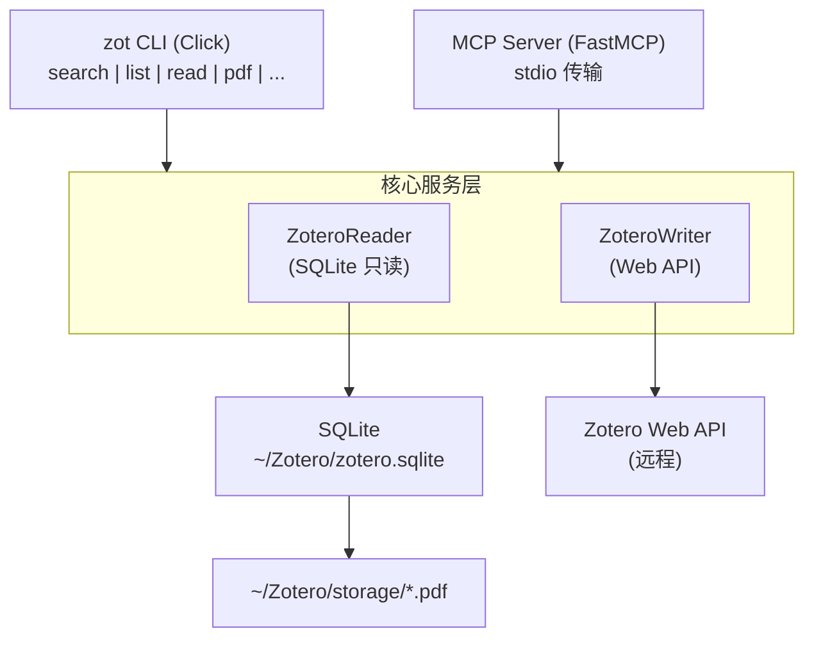

# zot — 让 Zotero 在终端飞起来

<p align="center">
  
</p>

<p align="center">
  <a href="https://pypi.org/project/zotero-cli-cc/"></a>
  <a href="https://github.com/Agents365-ai/zotero-cli-cc/actions/workflows/ci.yml"></a>
  <a href="https://pypi.org/project/zotero-cli-cc/"></a>
  <a href="https://creativecommons.org/licenses/by-nc/4.0/"></a>
</p>

[English](README_EN.md)

## 简介

`zotero-cli-cc` 是一个专为 [Claude Code](https://claude.ai/code) 设计的 Zotero 命令行工具。

**核心特性：**
- **读操作**：直接读取本地 SQLite 数据库，零配置、离线可用、毫秒级响应
- **写操作**：通过 Zotero Web API 安全写入，Zotero 完全感知变更
- **PDF 提取**：直接从本地存储提取 PDF 全文，自动缓存

**无需启动 Zotero 桌面端即可检索和阅读文献。**

## 在 Claude Code 中使用

在任何 Claude Code 会话中，直接用自然语言请求：

```
帮我搜索 Zotero 中关于 single cell 的论文
→ Claude 自动运行: zot --json search "single cell"

查看这篇论文的详情
→ Claude 自动运行: zot --json read ABC123

导出这篇论文的 BibTeX
→ Claude 自动运行: zot export ABC123
```

安装 zotero-cli skill 后，Claude Code 会自动识别文献相关请求并调用 `zot`：

```bash
# 安装 skill（将 skill/zotero-cli-cc/ 复制到 ~/.claude/skills/）
cp -r skill/zotero-cli-cc ~/.claude/skills/
```

## 安装

```bash
# 推荐
uv tool install zotero-cli-cc

# 或者
pipx install zotero-cli-cc

# 或者
pip install zotero-cli-cc
```

## 配置

```bash
# 配置 Web API 凭证（仅写操作需要）
zot config init
```

读操作开箱即用，只要 Zotero 数据在默认目录（`~/Zotero`）。

写操作需要 API Key，在 https://www.zotero.org/settings/keys 获取。

### MCP 服务器模式

zotero-cli-cc 支持 [MCP (Model Context Protocol)](https://modelcontextprotocol.io/)，可在 LM Studio、Claude Desktop、Cursor 等支持 MCP 的客户端中使用。

**安装 MCP 支持：**

```bash
pip install zotero-cli-cc[mcp]
```

**启动 MCP 服务器：**

```bash
zot mcp serve
```

**客户端配置（LM Studio / Claude Desktop / Cursor）：**

```json
{
  "mcpServers": {
    "zotero": {
      "command": "zot",
      "args": ["mcp", "serve"]
    }
  }
}
```

MCP 模式提供 17 个工具，涵盖搜索、阅读、PDF 提取、笔记管理、标签管理、导出引用等完整功能。

## 命令一览

### 检索与浏览

> **搜索原理：** `zot search` 会在四个层面进行关键词匹配：① 标题与摘要 ② 作者姓名 ③ 标签 ④ PDF 全文索引。其中 PDF 全文检索依赖 Zotero 客户端内建的 `fulltextWords` 词表索引，仅支持单词级别的 `LIKE` 模式匹配，没有相关性排序，也不支持短语或语义搜索。如需更强大的语义检索（向量搜索、BM25、跨语言匹配），请使用 [zotero-rag-cli (rak)](https://github.com/Agents365-ai/zotero-rag-cli)。

```bash
# 全库搜索（标题、作者、标签、全文）
zot search "transformer attention"

# 按 collection 过滤搜索
zot search "BERT" --collection "NLP"

# 列出文献
zot list --collection "Machine Learning" --limit 10

# 查看文献详情（元数据 + 摘要 + 笔记）
zot read ABC123

# 查找相关文献
zot relate ABC123
```

### 笔记与标签

```bash
# 查看/添加笔记
zot note ABC123
zot note ABC123 --add "这篇论文提出了新的注意力机制"

# 查看/添加/删除标签
zot tag ABC123
zot tag ABC123 --add "重要"
zot tag ABC123 --remove "待读"
```

### 引用导出

```bash
zot export ABC123                    # BibTeX
zot export ABC123 --format csl-json  # CSL-JSON
zot export ABC123 --format ris       # RIS
zot export ABC123 --format json      # JSON

# 格式化引用并复制到剪贴板
zot cite ABC123                      # APA（默认）
zot cite ABC123 --style nature       # Nature
zot cite ABC123 --style vancouver    # Vancouver
```

### 文献管理

```bash
zot add --doi "10.1038/s41586-023-06139-9"    # 通过 DOI 添加
zot add --url "https://arxiv.org/abs/2301.00001"  # 通过 URL 添加
zot add --from-file dois.txt                     # 从文件批量导入
zot delete ABC123 --yes                        # 删除（移入回收站）
```

### Collection 管理

```bash
zot collection list                # 列出所有 collection（树形展示）
zot collection items COLML01       # 查看 collection 内的文献
zot collection create "新项目"      # 创建新 collection
```

### 配置与档案

```bash
zot config profile list            # 列出所有配置档案
zot config profile set lab         # 设置默认档案
zot config cache stats             # 查看 PDF 缓存统计
zot config cache clear             # 清除 PDF 缓存
```

### AI 辅助功能

```bash
zot summarize ABC123               # 结构化摘要（专为 Claude Code 优化）
zot pdf ABC123                     # 提取 PDF 全文
zot pdf ABC123 --pages 1-5         # 提取指定页
```

### 全局选项

```bash
zot --json search "attention"              # JSON 输出
zot --limit 5 list                         # 限制结果数量
zot --detail minimal search "attention"    # 精简输出（仅 key/标题/作者/年份）
zot --detail full read ABC123              # 完整输出（含 extra 字段）
zot --no-interaction delete ABC123         # 跳过交互确认（AI/脚本模式）
zot --profile lab search "CRISPR"          # 使用指定配置档案
zot --version                              # 查看版本
```

### Shell 补全

```bash
# Zsh（推荐）
zot completions zsh >> ~/.zshrc

# Bash
zot completions bash >> ~/.bashrc

# Fish
zot completions fish > ~/.config/fish/completions/zot.fish
```

添加后重启终端或 `source` 配置文件即可使用 Tab 补全。

## 同类工具对比

| 特性 | **zotero-cli-cc** | [pyzotero-cli](https://github.com/chriscarrollsmith/pyzotero-cli) | [zotero-cli](https://github.com/jbaiter/zotero-cli) | [zotero-cli-tool](https://github.com/dhondta/zotero-cli) | [zotero-mcp](https://github.com/54yyyu/zotero-mcp) | [cookjohn/zotero-mcp](https://github.com/cookjohn/zotero-mcp) | [ZoteroBridge](https://github.com/Combjellyshen/ZoteroBridge) |
|---|:---:|:---:|:---:|:---:|:---:|:---:|:---:|
| **本地 SQLite 直读** | **✅** | ❌ | ❌ (仅缓存) | ❌ | ❌ | ❌ (插件) | ✅ |
| **离线可用** | **✅** | ❌ | ❌ | ❌ | ❌ | ❌ | ✅ |
| **无需启动 Zotero** | **✅** | ❌ | ❌ | ❌ | ❌ | ❌ | ✅ |
| **零配置读操作** | **✅** | ❌ | ❌ | ❌ | ❌ | ❌ | ✅ |
| **安全写入 (Web API)** | **✅** | ✅ | ✅ | ✅ | ✅ | ✅ | ❌ (直写 SQLite) |
| **PDF 全文提取** | **✅** | ❌ | ❌ | ❌ | ✅ | ✅ | ✅ |
| **AI 编码助手集成** | **✅ Claude Code** | 部分 | ❌ | ❌ | Claude/ChatGPT | Claude/Cursor | Claude/Cursor |
| **CLI 终端使用** | **✅** | ✅ | ✅ | ✅ | ❌ | ❌ | ❌ |
| **MCP 协议** | **✅** | ❌ | ❌ | ❌ | ✅ | ✅ | ✅ |
| **JSON 输出** | ✅ | ✅ | ❌ | ❌ | N/A | N/A | N/A |
| **笔记管理** | ✅ | ✅ | ✅ | ❌ | ❌ | ✅ | ✅ |
| **Collection 管理** | ✅ | ✅ | ❌ | ❌ | ✅ | ✅ | ✅ |
| **引用导出** | ✅ BibTeX/CSL-JSON/RIS | ✅ | ❌ | ✅ Excel | ❌ | ❌ | ❌ |
| **语义搜索** | [RAK](https://github.com/Agents365-ai/zotero-rag-cli) | ❌ | ❌ | ❌ | ✅ | ✅ | ❌ |
| **输出分级** | **✅** | ❌ | ❌ | ❌ | ✅ | ✅ | ❌ |
| **多配置档案** | **✅** | ✅ | ❌ | ❌ | ❌ | ❌ | ❌ |
| **PDF 缓存** | **✅** | ❌ | ❌ | ❌ | ❌ | ❌ | ❌ |
| **库维护** | ❌ | ❌ | ❌ | ❌ | ❌ | ❌ | ✅ |
| **语言** | Python | Python | Python | Python | Python | TypeScript | TypeScript |
| **活跃维护** | ✅ 2026 | ✅ 2025 | ❌ 2024 | ✅ 2026 | ✅ 2026 | ✅ 2026 | ✅ 2026 |

### 为什么选择 zotero-cli-cc？

> **唯一一个直接读取本地 SQLite 数据库的活跃 Python CLI 工具。**

- **极速**：毫秒级响应，无网络延迟
- **离线**：无需网络、无需启动 Zotero 桌面端
- **零配置**：安装即用，读操作无需 API Key
- **AI 原生**：专为 Claude Code 设计，`--json` 输出直接供 AI 解析
- **安全**：读写分离架构，写操作通过 Web API 确保 Zotero 数据库完整性
- **终端原生**：唯一同时支持本地 SQLite 直读和安全写入的 CLI 工具，MCP 工具无法在终端中直接使用

## 架构



## 环境变量

| 变量 | 用途 |
|------|------|
| `ZOT_DATA_DIR` | 覆盖 Zotero 数据目录路径 |
| `ZOT_LIBRARY_ID` | 覆盖 Library ID（写操作） |
| `ZOT_API_KEY` | 覆盖 API Key（写操作） |
| `ZOT_PROFILE` | 覆盖默认配置档案 |

## TODO

- [x] 改进 HTML 转 Markdown：支持列表、链接、表格等 Zotero 笔记常用格式（v0.1.2：使用 markdownify）
- [x] `summarize-all` 分页：为大型文献库添加 offset/cursor 分页支持（v0.1.2：`--offset` 参数）
- [x] 危险操作 `--dry-run`：为 `delete`、`collection delete`、`tag` 添加预览模式（v0.1.2）

### Features

- [x] `zot cite`：格式化引用并复制到剪贴板（APA、Nature、Vancouver）
- [x] 批量操作：从文件批量导入（`zot add --from-file dois.txt`）
- [x] `zot export`：增加 RIS 格式支持（BibTeX、CSL-JSON、RIS、JSON）

### Polish

- [ ] GitHub Issues / Discussions：开放用户反馈渠道
- [x] 改进 `--help` 文本：添加使用示例
- [x] Shell 补全安装说明：在 README 中添加 zsh/bash/fish 安装指引

### Distribution

- [x] `pipx` 安装说明
- [ ] Homebrew formula
- [x] GitHub Releases：附带 changelog（v0.1.1, v0.1.2）
- [x] README 徽章：PyPI 版本、CI 状态、Python 版本、License

### MCP Server

- [ ] 扩展 MCP 工具：collection 管理、导出、高级搜索
- [ ] MCP 服务器文档 / 集成指南

---

## 支持作者 / Support

<table>
  <tr>
    <td align="center">
      
      <br>
      <b>微信支付</b>
    </td>
    <td align="center">
      
      <br>
      <b>支付宝</b>
    </td>
    <td align="center">
      
      <br>
      <b>Buy Me a Coffee</b>
    </td>
  </tr>
</table>

## 许可证 / License

[CC BY-NC 4.0](https://creativecommons.org/licenses/by-nc/4.0/) — 免费用于非商业用途 / Free for non-commercial use.
