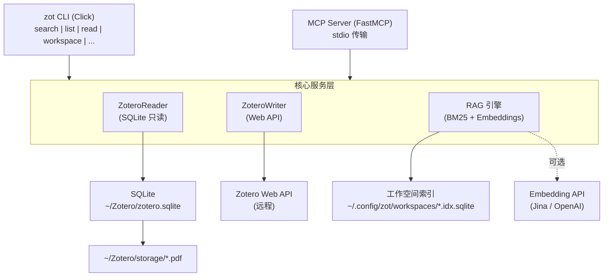

# zot — 让 Zotero 在终端飞起来

<p align="center">
  
</p>

<p align="center">
  <a href="https://pypi.org/project/zotero-cli-cc/"></a>
  <a href="https://github.com/Agents365-ai/zotero-cli-cc/actions/workflows/ci.yml"></a>
  <a href="https://pypi.org/project/zotero-cli-cc/"></a>
  <a href="https://creativecommons.org/licenses/by-nc/4.0/"></a>
</p>

[English](README.md)

## 简介

`zotero-cli-cc` 是一个专为 [Claude Code](https://claude.ai/code) 设计的 Zotero 命令行工具。

**核心特性：**
- **读操作**：直接读取本地 SQLite 数据库，零配置、离线可用、毫秒级响应
- **写操作**：通过 Zotero Web API 安全写入，Zotero 完全感知变更
- **PDF 提取**：直接从本地存储提取 PDF 全文，自动缓存
- **工作空间**：按主题组织文献，内置轻量级 RAG 检索

**无需启动 Zotero 桌面端即可检索和阅读文献。**

## 在 Claude Code 中使用

在任何 Claude Code 会话中，直接用自然语言请求：

```
帮我搜索 Zotero 中关于 single cell 的论文
→ Claude 自动运行: zot --json search "single cell"

查看这篇论文的详情
→ Claude 自动运行: zot --json read ABC123

导出这篇论文的 BibTeX
→ Claude 自动运行: zot export ABC123
```

安装 zotero-cli skill 后，Claude Code 会自动识别文献相关请求并调用 `zot`：

```bash
# 安装 skill（将 skill/zotero-cli-cc/ 复制到 ~/.claude/skills/）
cp -r skill/zotero-cli-cc ~/.claude/skills/
```

## 安装

```bash
# 推荐
uv tool install zotero-cli-cc

# 或者
pipx install zotero-cli-cc

# 或者
pip install zotero-cli-cc
```

升级到最新版本：

```bash
uv tool upgrade zotero-cli-cc    # uv
pipx upgrade zotero-cli-cc       # pipx
pip install -U zotero-cli-cc     # pip
```

## 配置

```bash
# 配置 Web API 凭证（仅写操作需要）
zot config init
```

### 数据目录

> **数据目录**是指包含 `zotero.sqlite` 数据库文件的目录（不是 Zotero 程序安装目录，也不是 PDF 同步目录）。通常在 Zotero 设置 → 高级 → "数据存储位置" 中查看。

读操作开箱即用，`zot` 会自动检测 Zotero 数据目录：

| 平台 | 检测顺序 |
|------|----------|
| **Windows** | 注册表 `HKCU\Software\Zotero\Zotero\dataDir` → `%APPDATA%\Zotero` → `%LOCALAPPDATA%\Zotero` |
| **macOS / Linux** | `~/Zotero` |

如果 Zotero 数据不在默认目录，可以通过以下方式指定：

```bash
# 方式一：配置文件（推荐）
zot config init --data-dir "D:\MyZotero"

# 方式二：环境变量
export ZOT_DATA_DIR="/path/to/zotero/data"

# 方式三：手动编辑配置文件
# 编辑 ~/.config/zot/config.toml
```

配置文件示例：

```toml
[zotero]
data_dir = "D:\\MyZotero"
library_id = "12345"
api_key = "xxx"

[output]
default_format = "table"
limit = 50

[export]
default_style = "bibtex"
```

### API 凭证

写操作需要 API Key，在 https://www.zotero.org/settings/keys 获取。

### MCP 服务器模式

zotero-cli-cc 支持 [MCP (Model Context Protocol)](https://modelcontextprotocol.io/)，可在 LM Studio、Claude Desktop、Cursor 等支持 MCP 的客户端中使用。

**安装 MCP 支持：**

```bash
pip install zotero-cli-cc[mcp]
```

**启动 MCP 服务器：**

```bash
zot mcp serve
```

**客户端配置（LM Studio / Claude Desktop / Cursor）：**

```json
{
  "mcpServers": {
    "zotero": {
      "command": "zot",
      "args": ["mcp", "serve"]
    }
  }
}
```

MCP 模式提供 45 个工具，涵盖搜索、阅读、PDF 提取、笔记管理、标签管理、导出引用���工作区 RAG、库统计、预���本状态检查等完整功能。

## 命令一览

### 检索与浏览

> **搜索原理：** `zot search` 会在四个层面进行关键词匹配：① 标题与摘要 ② 作者姓名 ③ 标签 ④ PDF 全文索引。如需更深层的内容检索（BM25 排序 + 可选语义匹配），可使用 `zot workspace query` — 它索引元数据 + PDF 全文，支持混合 BM25 + embedding 检索。

```bash
# 全库搜索（标题、作者、标签、全文）
zot search "transformer attention"

# 按 collection 过滤搜索
zot search "BERT" --collection "NLP"

# 列出文献
zot list --collection "Machine Learning" --limit 10

# 查看文献详情（元数据 + 摘要 + 笔记）
zot read ABC123

# 查找相关文献
zot relate ABC123
```

### 笔记与标签

```bash
# 查看/添加笔记
zot note ABC123
zot note ABC123 --add "这篇论文提出了新的注意力机制"

# 查看/添加/删除标签
zot tag ABC123
zot tag ABC123 --add "重要"
zot tag ABC123 --remove "待读"
```

### 引用导出

```bash
zot export ABC123                    # BibTeX
zot export ABC123 --format csl-json  # CSL-JSON
zot export ABC123 --format ris       # RIS
zot export ABC123 --format json      # JSON

# 格式化引用并复制到剪贴板
zot cite ABC123                      # APA（默认）
zot cite ABC123 --style nature       # Nature
zot cite ABC123 --style vancouver    # Vancouver
```

### 文献管理

```bash
zot add --doi "10.1038/s41586-023-06139-9"    # 通过 DOI 添加
zot add --url "https://arxiv.org/abs/2301.00001"  # 通过 URL 添加
zot add --from-file dois.txt                     # 从文件批量导入
zot delete ABC123 --yes                        # 删除（移入回收站）
```

### Collection 管理

```bash
zot collection list                # 列出所有 collection（树形展示）
zot collection items COLML01       # 查看 collection 内的文献
zot collection create "新项目"      # 创建新 collection
```

### 工作空间（Workspace）

> **为什么需要工作空间？** Zotero Collection 适合永久性的文献库组织，但科研工作中经常需要临时的、跨越多个 Collection 的文献分组——"ICML 投稿相关论文"、"组会要讨论的论文"、"第三章参考文献"。工作空间填补了这个空白：它是轻量级的本地视图，不会修改 Zotero 数据。每个工作空间是一个简单的 TOML 文件 (`~/.config/zot/workspaces/<name>.toml`)，只存储条目 key 引用——不需要 API key，不会产生同步副作用。结合内置的 RAG 索引，工作空间成为连接 Zotero 文献库和 AI 编程助手（如 Claude Code）的桥梁。

```bash
# 创建并填充工作空间
zot workspace new llm-safety --description "LLM 对齐与安全论文"
zot workspace add llm-safety ABC123 DEF456 GHI789
zot workspace import llm-safety --collection "Alignment"   # 从 collection 批量导入
zot workspace import llm-safety --tag "safety"              # 按标签导入
zot workspace import llm-safety --search "RLHF"            # 按搜索导入

# 浏览工作空间
zot workspace list                          # 列出所有工作空间
zot workspace show llm-safety               # 查看条目及元数据
zot workspace search "reward" --workspace llm-safety  # 在工作空间内搜索

# 导出（供 AI 使用）
zot workspace export llm-safety                       # Markdown（适合 Claude Code）
zot workspace export llm-safety --format json         # JSON
zot workspace export llm-safety --format bibtex       # BibTeX

# 内置 RAG：索引与查询
zot workspace index llm-safety              # 构建 BM25 索引（元数据 + PDF 全文）
zot workspace query "reward hacking methods" --workspace llm-safety

# 管理
zot workspace remove llm-safety ABC123      # 移除条目
zot workspace delete llm-safety --yes       # 删除工作空间
```

**可选语义搜索** — 配置 embedding 端点以启用混合 BM25 + 向量检索：

```bash
export ZOT_EMBEDDING_URL="https://api.jina.ai/v1/embeddings"
export ZOT_EMBEDDING_KEY="your-jina-key"   # 10M 免费 tokens
zot workspace index llm-safety --force      # 重建索引（含 embedding）
zot workspace query "reward hacking" --workspace llm-safety --mode hybrid
```

### 配置与档案

```bash
zot config profile list            # 列出所有配置档案
zot config profile set lab         # 设置默认档案
zot config cache stats             # 查看 PDF 缓存统计
zot config cache clear             # 清除 PDF 缓存
```

### 预印本状态检查

```bash
# 检查 arXiv/bioRxiv/medRxiv 预印本是否已正式发表（默认仅预览）
zot update-status

# 实际更新 Zotero 元数据
zot update-status --apply

# 检查单篇
zot update-status ABC123

# 检查某个 collection 内的预印本
zot update-status --collection "scRNA-seq" --limit 20
```

使用 [Semantic Scholar API](https://www.semanticscholar.org/product/api)。可选 API key 以提升速率限制：

```bash
export S2_API_KEY=your_key_here   # 写入 ~/.zshrc 或 ~/.bashrc
```

### AI 辅助功能

```bash
zot summarize ABC123               # 结构化摘要（专为 Claude Code 优化）
zot pdf ABC123                     # 提取 PDF 全文
zot pdf ABC123 --pages 1-5         # 提取指定页
```

### 全局选项

```bash
zot --json search "attention"              # JSON 输出
zot --limit 5 list                         # 限制结果数量
zot --detail minimal search "attention"    # 精简输出（仅 key/标题/作者/年份）
zot --detail full read ABC123              # 完整输出（含 extra 字段）
zot --no-interaction delete ABC123         # 跳过交互确认（AI/脚本模式）
zot --profile lab search "CRISPR"          # 使用指定配置档案
zot --version                              # 查看版本
```

### Shell 补全

```bash
# Zsh（推荐）
zot completions zsh >> ~/.zshrc

# Bash
zot completions bash >> ~/.bashrc

# Fish
zot completions fish > ~/.config/fish/completions/zot.fish
```

添加后重启终端或 `source` 配置文件即可使用 Tab 补全。

## 同类工具对比

| 特性 | **zotero-cli-cc** | [pyzotero-cli](https://github.com/chriscarrollsmith/pyzotero-cli) | [zotero-cli](https://github.com/jbaiter/zotero-cli) | [zotero-cli-tool](https://github.com/dhondta/zotero-cli) | [zotero-mcp](https://github.com/54yyyu/zotero-mcp) | [cookjohn/zotero-mcp](https://github.com/cookjohn/zotero-mcp) | [ZoteroBridge](https://github.com/Combjellyshen/ZoteroBridge) |
|---|:---:|:---:|:---:|:---:|:---:|:---:|:---:|
| **本地 SQLite 直读** | **✅** | ❌ | ❌ (仅缓存) | ❌ | ❌ | ❌ (插件) | ✅ |
| **离线可用** | **✅** | ❌ | ❌ | ❌ | ❌ | ❌ | ✅ |
| **无需启动 Zotero** | **✅** | ❌ | ❌ | ❌ | ❌ | ❌ | ✅ |
| **零配置读操作** | **✅** | ❌ | ❌ | ❌ | ❌ | ❌ | ✅ |
| **安全写入 (Web API)** | **✅** | ✅ | ✅ | ✅ | ✅ | ✅ | ❌ (直写 SQLite) |
| **PDF 全文提取** | **✅** | ❌ | ❌ | ❌ | ✅ | ✅ | ✅ |
| **AI 编码助手集成** | **✅ Claude Code** | 部分 | ❌ | ❌ | Claude/ChatGPT | Claude/Cursor | Claude/Cursor |
| **CLI 终端使用** | **✅** | ✅ | ✅ | ✅ | ❌ | ❌ | ❌ |
| **MCP 协议** | **✅** | ❌ | ❌ | ❌ | ✅ | ✅ | ✅ |
| **JSON 输出** | ✅ | ✅ | ❌ | ❌ | N/A | N/A | N/A |
| **笔记管理** | ✅ | ✅ | ✅ | ❌ | ❌ | ✅ | ✅ |
| **Collection 管理** | ✅ | ✅ | ❌ | ❌ | ✅ | ✅ | ✅ |
| **引用导出** | ✅ BibTeX/CSL-JSON/RIS | ✅ | ❌ | ✅ Excel | ❌ | ❌ | ❌ |
| **语义搜索** | **✅ 内置（工作空间 RAG）** | ❌ | ❌ | ❌ | ✅ | ✅ | ❌ |
| **输出分级** | **✅** | ❌ | ❌ | ❌ | ✅ | ✅ | ❌ |
| **多配置档案** | **✅** | ✅ | ❌ | ❌ | ❌ | ❌ | ❌ |
| **PDF 缓存** | **✅** | ❌ | ❌ | ❌ | ❌ | ❌ | ❌ |
| **库维护** | ❌ | ❌ | ❌ | ❌ | ❌ | ❌ | ✅ |
| **语言** | Python | Python | Python | Python | Python | TypeScript | TypeScript |
| **活跃维护** | ✅ 2026 | ✅ 2025 | ❌ 2024 | ✅ 2026 | ✅ 2026 | ✅ 2026 | ✅ 2026 |

### 为什么选择 zotero-cli-cc？

> **唯一一个直接读取本地 SQLite 数据库的活跃 Python CLI 工具。**

- **极速**：毫秒级响应，无网络延迟
- **离线**：无需网络、无需启动 Zotero 桌面端
- **零配置**：安装即用，读操作无需 API Key
- **AI 原生**：专为 Claude Code 设计，`--json` 输出直接供 AI 解析
- **安全**：读写分离架构，写操作通过 Web API 确保 Zotero 数据库完整性
- **终端原生**：唯一同时支持本地 SQLite 直读和安全写入的 CLI 工具，MCP 工具无法在终端中直接使用

## 架构



## 环境变量

| 变量 | 用途 |
|------|------|
| `ZOT_DATA_DIR` | 覆盖 Zotero 数据目录路径 |
| `ZOT_LIBRARY_ID` | 覆盖 Library ID（写操作） |
| `ZOT_API_KEY` | 覆盖 API Key（写操作） |
| `ZOT_PROFILE` | 覆盖默认配置档案 |
| `S2_API_KEY` | Semantic Scholar API key（用于 `update-status`） |
| `ZOT_EMBEDDING_URL` | Embedding API 端点（默认：Jina AI） |
| `ZOT_EMBEDDING_KEY` | Embedding API 密钥（启用语义工作空间搜索） |
| `ZOT_EMBEDDING_MODEL` | Embedding 模型名称（默认：`jina-embeddings-v3`） |

## TODO

- [x] 改进 HTML 转 Markdown：支持列表、链接、表格等 Zotero 笔记常用格式（v0.1.2：使用 markdownify）
- [x] `summarize-all` 分页：为大型文献库添加 offset/cursor 分页支持（v0.1.2：`--offset` 参数）
- [x] 危险操作 `--dry-run`：为 `delete`、`collection delete`、`tag` 添加预览模式（v0.1.2）

### Features

- [x] `zot cite`：格式化引用并复制到剪贴板（APA、Nature、Vancouver）
- [x] 批量操作：从文件批量导入（`zot add --from-file dois.txt`）
- [x] `zot export`：增加 RIS 格式支持（BibTeX、CSL-JSON、RIS、JSON）

### Tier 1 — High Value, Moderate Effort

- [x] `zot update KEY --title/--date/--field`：更新条目元数据（pyzotero `update_item()` 已支持）
- [x] `zot search --type journalArticle`：按条目类型过滤搜索结果
- [x] `zot search --sort dateAdded --direction desc`：搜索/列表排序控制
- [x] `zot recent --days 7`：最近添加/修改的条目
- [x] `zot pdf KEY --annotations`：提取 PDF 标注（高亮、批注、页码）— pymupdf 已支持

### Tier 2 — High Value, Higher Effort ✅

- [x] `zot duplicates --by doi|title|both`：重复检测（模糊标题 + DOI 比对）
- [x] `zot trash list/restore`：回收站管理（查看 + 恢复）
- [x] `zot attach KEY --file paper.pdf`：附件上传
- [x] `--library group:<id>`：群组文库支持（所有命令 + MCP 工具）
- [x] `zot add --pdf paper.pdf`：从本地 PDF 添加（自动提取 DOI + 附件上传）

### Tier 3 — Medium Value

- [ ] Saved searches CRUD：保存的搜索管理
- [ ] 更多导出格式：BibLaTeX、MODS、TEI、CSV
- [ ] 格式化参考文献：通过 citeproc-py 生成 CSL 格式参考文献表
- [ ] `zot collection remove`：从集合移除条目（`collection move` 的对应操作）
- [ ] BetterBibTeX citation key 查找支持

### Tier 4 — Nice to Have

- [x] 语义搜索：通过工作空间 RAG 实现（BM25 + 可选 embedding，v0.2.0）
- [ ] DOI-to-key 索引
- [ ] 版本跟踪 / 增量同步
- [ ] Web 界面（`zot serve`）
- [ ] 按集合查看标签

### Polish

- [ ] GitHub Issues / Discussions：开放用户反馈渠道
- [x] 改进 `--help` 文本：添加使用示例
- [x] Shell 补全安装说明：在 README 中添加 zsh/bash/fish 安装指引

### Distribution

- [x] `pipx` 安装说明
- [x] GitHub Releases：附带 changelog（v0.1.1, v0.1.2）
- [x] README 徽章：PyPI 版本、CI 状态、Python 版本、License

### MCP Server

- [x] 扩��� MCP 工具：workspace、cite、stats、update-status��共 45 个工具）
- [ ] MCP 服务器文档 / 集成指南

---

## 支持作者 / Support

<table>
  <tr>
    <td align="center">
      
      <br>
      <b>微信支付</b>
    </td>
    <td align="center">
      
      <br>
      <b>支付宝</b>
    </td>
    <td align="center">
      
      <br>
      <b>Buy Me a Coffee</b>
    </td>
  </tr>
</table>

## 许可证 / License

[CC BY-NC 4.0](https://creativecommons.org/licenses/by-nc/4.0/) — 免费用于非商业用途 / Free for non-commercial use.
