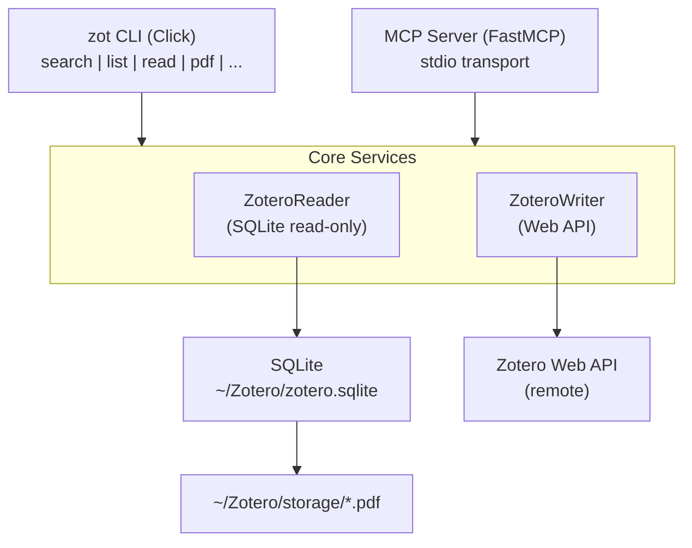

# zot — Let Zotero Fly in Your Terminal

[中文](README.md)

## Introduction

`zotero-cli-cc` is a Zotero CLI designed for [Claude Code](https://claude.ai/code).

**Core Features:**
- **Reads**: Direct local SQLite database access — zero config, offline, millisecond response
- **Writes**: Safe writes through Zotero Web API — Zotero fully aware of changes
- **PDF**: Extract full text from local PDF storage with automatic caching

**Search and read papers without launching Zotero desktop.**

## Install

```bash
# Recommended
uv tool install zotero-cli-cc

# Or
pip install zotero-cli-cc
```

## Setup

```bash
# Configure Web API credentials (write operations only)
zot config init
```

Read operations work out of the box as long as Zotero data is in the default directory (`~/Zotero`).

Write operations require an API Key from https://www.zotero.org/settings/keys.

### MCP Server Mode

zotero-cli-cc supports [MCP (Model Context Protocol)](https://modelcontextprotocol.io/) and can be used in MCP-compatible clients like LM Studio, Claude Desktop, and Cursor.

**Install MCP Support:**

```bash
pip install zotero-cli-cc[mcp]
```

**Start MCP Server:**

```bash
zot mcp serve
```

**Client Configuration (LM Studio / Claude Desktop / Cursor):**

```json
{
  "mcpServers": {
    "zotero": {
      "command": "zot",
      "args": ["mcp", "serve"]
    }
  }
}
```

MCP mode provides 17 tools covering search, reading, PDF extraction, note management, tag management, citation export, and more.

## Commands

### Search & Browse

> **How search works:** `zot search` matches keywords across four layers: ① titles & abstracts ② author names ③ tags ④ PDF fulltext index. The PDF fulltext search relies on Zotero's built-in `fulltextWords` word-level index — it only supports simple `LIKE` pattern matching with no relevance ranking, phrase matching, or semantic understanding. For advanced semantic search (vector search, BM25, cross-language matching), use [zotero-rag-cli (rak)](https://github.com/Agents365-ai/zotero-rag-cli).

```bash
# Search across title, author, tags, fulltext
zot search "transformer attention"

# Filter by collection
zot search "BERT" --collection "NLP"

# List items
zot list --collection "Machine Learning" --limit 10

# View item details (metadata + abstract + notes)
zot read ABC123

# Find related items
zot relate ABC123
```

### Notes & Tags

```bash
# View/add notes
zot note ABC123
zot note ABC123 --add "This paper proposes a new attention mechanism"

# View/add/remove tags
zot tag ABC123
zot tag ABC123 --add "important"
zot tag ABC123 --remove "to-read"
```

### Citation Export

```bash
zot export ABC123                  # BibTeX
zot export ABC123 --format json    # JSON
```

### Item Management

```bash
zot add --doi "10.1038/s41586-023-06139-9"    # Add by DOI
zot add --url "https://arxiv.org/abs/2301.00001"  # Add by URL
zot delete ABC123 --yes                        # Delete (move to trash)
```

### Collections

```bash
zot collection list                # List all collections (tree view)
zot collection items COLML01       # View items in a collection
zot collection create "New Project"  # Create a new collection
```

### Profiles & Cache

```bash
zot config profile list            # List all config profiles
zot config profile set lab         # Set default profile
zot config cache stats             # Show PDF cache statistics
zot config cache clear             # Clear PDF cache
```

### AI Features

```bash
zot summarize ABC123               # Structured summary (optimized for Claude Code)
zot pdf ABC123                     # Extract PDF full text
zot pdf ABC123 --pages 1-5         # Extract specific pages
```

### Global Flags

| Flag | Purpose |
|------|---------|
| `--json` | JSON output (use for programmatic processing) |
| `--limit N` | Limit results (default: 50) |
| `--detail minimal` | Only key/title/authors/year — saves tokens |
| `--detail full` | Include extra fields |
| `--no-interaction` | Suppress prompts (for automation) |
| `--profile NAME` | Use a specific config profile |
| `--version` | Show version |

## Comparison with Similar Tools

| Feature | **zotero-cli-cc** | [pyzotero-cli](https://github.com/chriscarrollsmith/pyzotero-cli) | [zotero-cli](https://github.com/jbaiter/zotero-cli) | [zotero-cli-tool](https://github.com/dhondta/zotero-cli) | [zotero-mcp](https://github.com/54yyyu/zotero-mcp) | [cookjohn/zotero-mcp](https://github.com/cookjohn/zotero-mcp) | [ZoteroBridge](https://github.com/Combjellyshen/ZoteroBridge) |
|---|:---:|:---:|:---:|:---:|:---:|:---:|:---:|
| **Direct SQLite Read** | **✅** | ❌ | ❌ (cache only) | ❌ | ❌ | ❌ (plugin) | ✅ |
| **Offline Read** | **✅** | ❌ | ❌ | ❌ | ❌ | ❌ | ✅ |
| **No Zotero Running** | **✅** | ❌ | ❌ | ❌ | ❌ | ❌ | ✅ |
| **Zero-Config Read** | **✅** | ❌ | ❌ | ❌ | ❌ | ❌ | ✅ |
| **Safe Write (Web API)** | **✅** | ✅ | ✅ | ✅ | ✅ | ✅ | ❌ (direct SQLite) |
| **PDF Full-Text** | **✅** | ❌ | ❌ | ❌ | ✅ | ✅ | ✅ |
| **AI Coding Assistant** | **✅ Claude Code** | Partial | ❌ | ❌ | Claude/ChatGPT | Claude/Cursor | Claude/Cursor |
| **Terminal CLI** | **✅** | ✅ | ✅ | ✅ | ❌ | ❌ | ❌ |
| **MCP Protocol** | **✅** | ❌ | ❌ | ❌ | ✅ | ✅ | ✅ |
| **JSON Output** | ✅ | ✅ | ❌ | ❌ | N/A | N/A | N/A |
| **Note Management** | ✅ | ✅ | ✅ | ❌ | ❌ | ✅ | ✅ |
| **Collections** | ✅ | ✅ | ❌ | ❌ | ✅ | ✅ | ✅ |
| **Citation Export** | ✅ BibTeX/JSON | ✅ | ❌ | ✅ Excel | ❌ | ❌ | ❌ |
| **Semantic Search** | ❌ | ❌ | ❌ | ❌ | ✅ | ✅ | ❌ |
| **Detail Levels** | **✅** | ❌ | ❌ | ❌ | ✅ | ✅ | ❌ |
| **Multi-Profile** | **✅** | ✅ | ❌ | ❌ | ❌ | ❌ | ❌ |
| **PDF Cache** | **✅** | ❌ | ❌ | ❌ | ❌ | ❌ | ❌ |
| **Library Maintenance** | ❌ | ❌ | ❌ | ❌ | ❌ | ❌ | ✅ |
| **Language** | Python | Python | Python | Python | Python | TypeScript | TypeScript |
| **Active** | ✅ 2026 | ✅ 2025 | ❌ 2024 | ✅ 2026 | ✅ 2026 | ✅ 2026 | ✅ 2026 |

### Why zotero-cli-cc?

> **The only actively maintained Python CLI that reads Zotero's local SQLite database directly.**

- **Fast**: Millisecond response, no network latency
- **Offline**: No internet, no Zotero desktop needed
- **Zero-Config**: Install and go, no API key for reads
- **AI-Native**: Built for Claude Code, `--json` output for AI consumption
- **Safe**: Read/write separation — writes go through Web API to protect DB integrity
- **Terminal-Native**: The only CLI combining local SQLite reads with safe Web API writes; MCP tools require AI client, not usable in terminal

## Architecture



## Using with Claude Code

In any Claude Code session, use natural language:

```
Search my Zotero for single cell papers
→ Claude runs: zot --json search "single cell"

Show me details of this paper
→ Claude runs: zot --json read ABC123

Export BibTeX for this paper
→ Claude runs: zot export ABC123
```

Install the zotero-cli skill so Claude Code automatically recognizes literature-related requests:

```bash
# Install skill (copy skill/zotero-cli/ to ~/.claude/skills/)
cp -r skill/zotero-cli ~/.claude/skills/
```

## Environment Variables

| Variable | Purpose |
|----------|---------|
| `ZOT_DATA_DIR` | Override Zotero data directory path |
| `ZOT_LIBRARY_ID` | Override Library ID (write operations) |
| `ZOT_API_KEY` | Override API Key (write operations) |
| `ZOT_PROFILE` | Override default config profile |

---

## Support

<table>
  <tr>
    <td align="center">
      
      <br>
      <b>WeChat Pay</b>
    </td>
    <td align="center">
      
      <br>
      <b>Alipay</b>
    </td>
    <td align="center">
      
      <br>
      <b>Buy Me a Coffee</b>
    </td>
  </tr>
</table>

## License

[CC BY-NC 4.0](https://creativecommons.org/licenses/by-nc/4.0/) — Free for non-commercial use.
